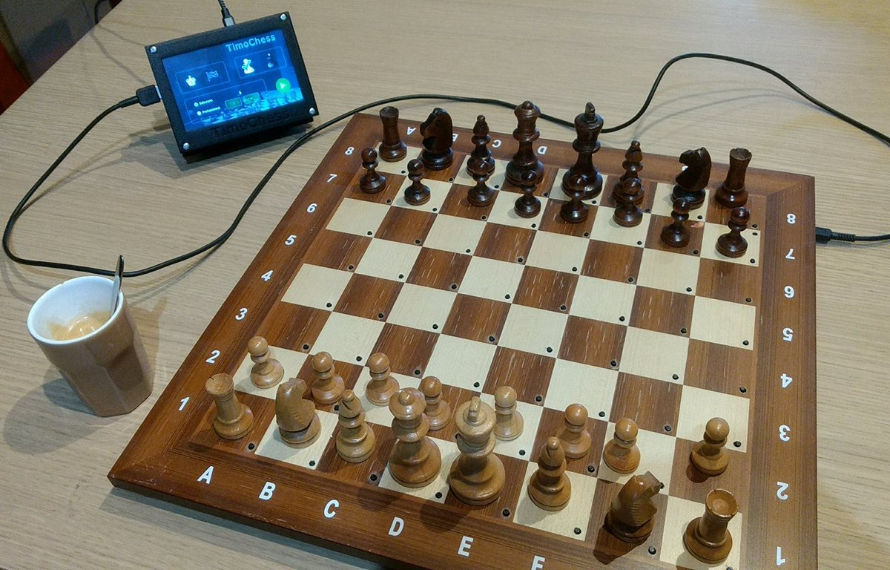
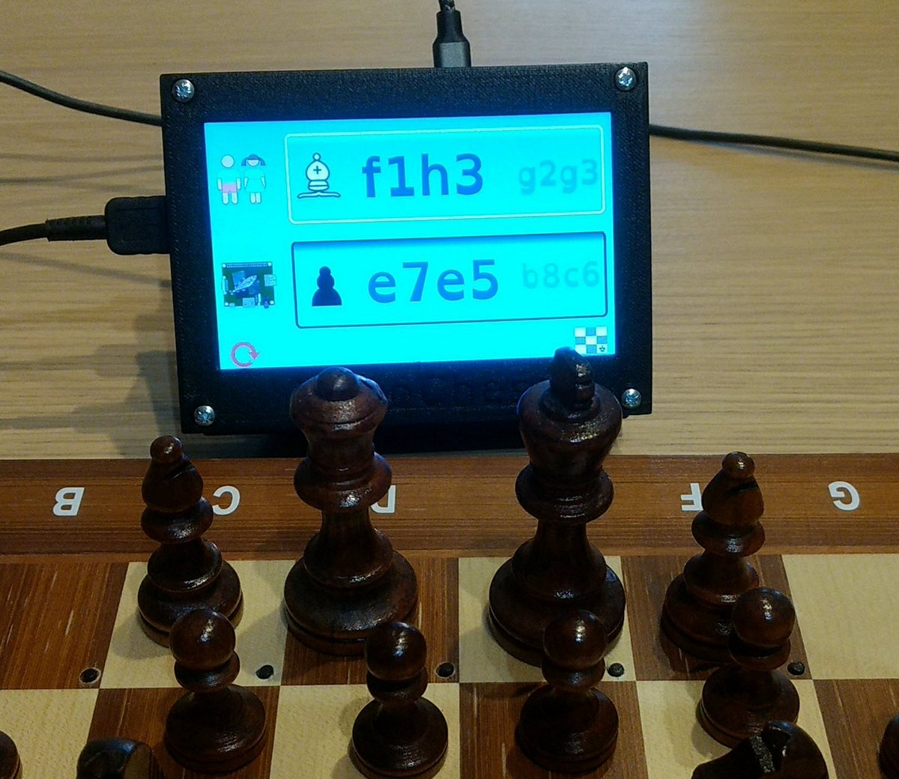
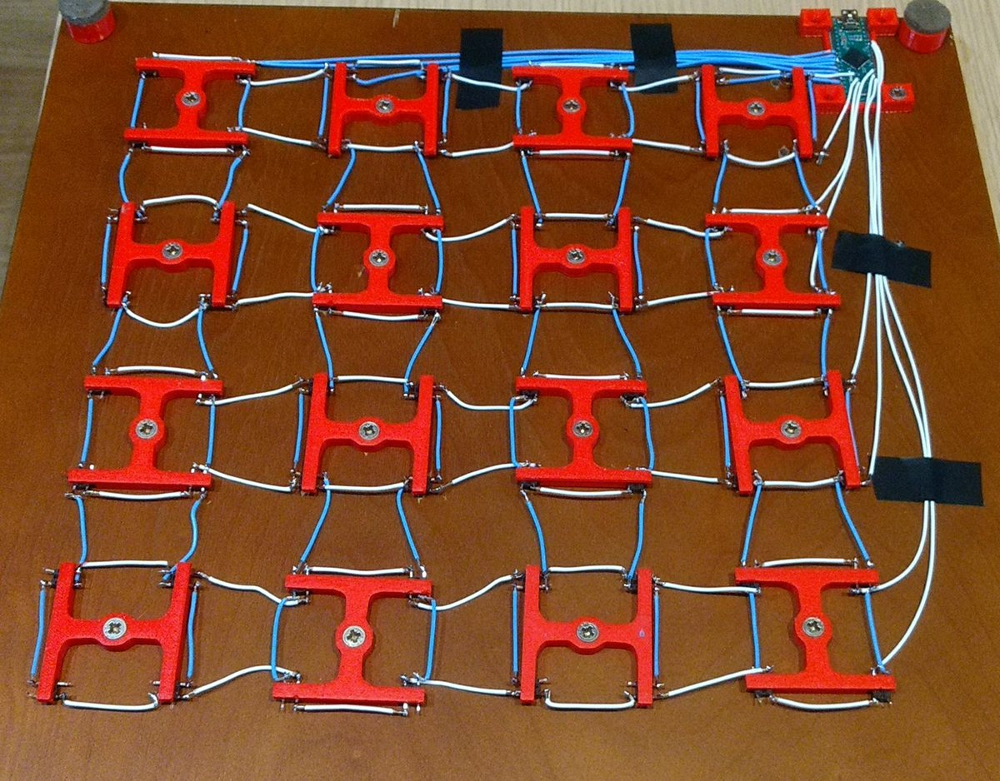
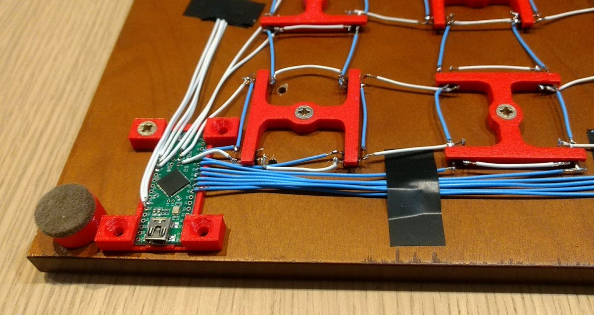

# TimoChess

This goal of this project was to be able to play chess against a computer but using a real board and real pieces. Of course i wanted to limit the cost.
  

  
Behind this  Waveshare 5 inches TFT screen (800x480) there's a Raspberry PI 2 on which runs the UI (the acutal code source you find here) and the <a href="https://stockfishchess.org/">stockfish chess engine</a>. 
The UI is based on Juce (https://www.juce.com/).
  

  
It uses a regular chess board. I drilled 64 holes so that push buttons go through and appear above the surface. Push buttons are fixed from the bottom with custom 3D printed (red) pieces.  
It takes some time to solder all those wires but it's simple.
  

  
Under the board there's a <a href="https://www.pjrc.com/store/teensypp.html">Teensy++</a> small board that constantly scan the buttons to verify if one is pressed. This board register itself as a regular USB keyboard to the Rasperry pi and send coordinate of the button you press.
  

  
The SD image boots quickly and starts directly into the TimoChess UI (full screen) where you can chose, the type of game (Regular or KingRace), the color you want to play and the level. The display is touch sensitive and you're asked to calibrate it the first time it's run.  
Here is the <a href="https://github.com/Ixox/meta-xavier">Yoco meta layer i wrote</a> to build the SD Linux image.
  
Xavier Hosxe
